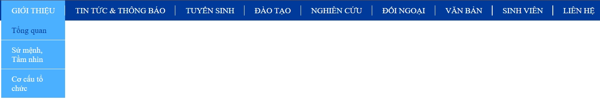
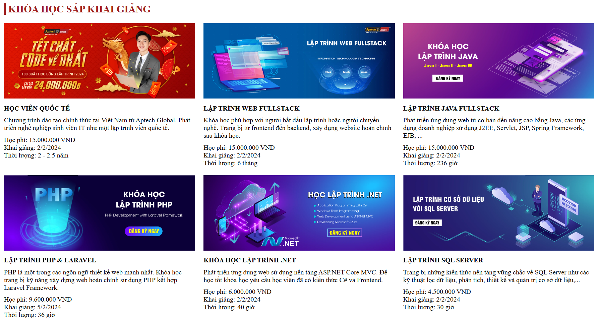
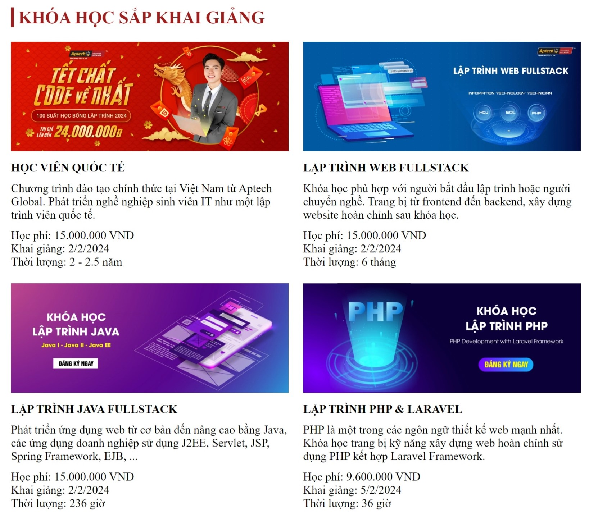
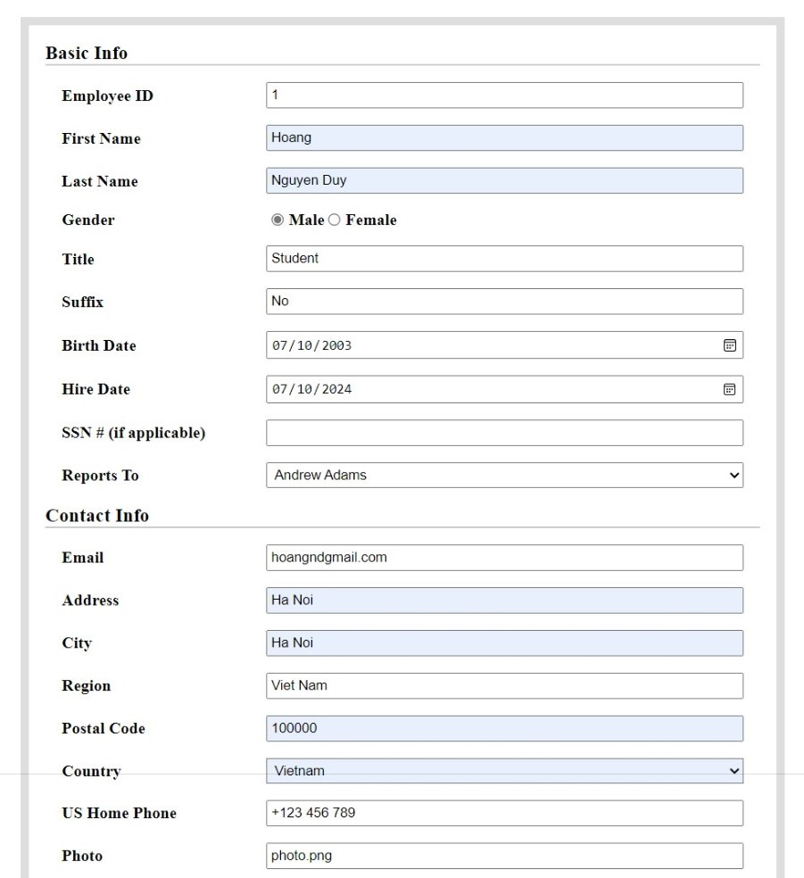
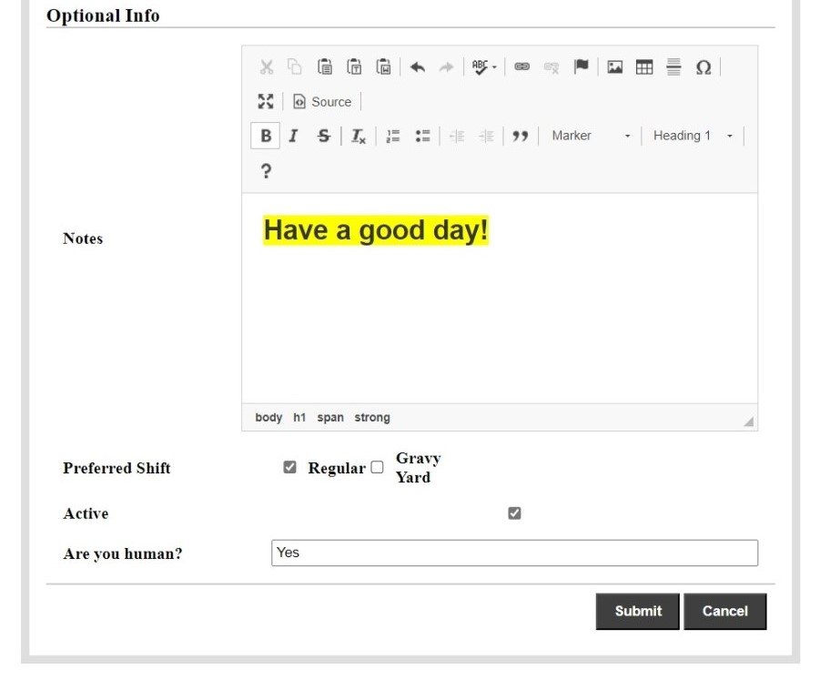

### Project 12 - Build a multi-level navigation bar

### Project 13 - Create course lists with responsive design
#### Responsive design for desktop

#### Responsive design for tablet

#### Responsive design for mobile

### Project 14 - Create a form with dynamic input fields 
#### Reports To and Country fields are dynamic

#### Creates a data entry element containing formatting tools - using CKEditor
