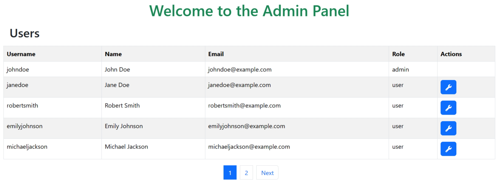

### Project 21 - The product category has pagination (GET method)

### Project 22 - Update user profile with the Upload Avatar feature (POST method)
##### User profile page

##### After update user profile

### Project 23 - Simple login and user profile with array, Session and Cookies
##### Login page

##### Error when user not logged in

##### User profile page

### Project 24 - Basic user authentication and authorization with array, Session, Cookies
##### Login page

##### Error when user not logged in

##### Admin profile page

##### User profile page

##### Update user profile page

##### Admin panel page

##### Edit user page (Admin)

### Project 25 - Building a book database using MySQL and reviewing SQL queries
##### Books table

##### Authors table

##### Books_Authors table

##### Reviews table

